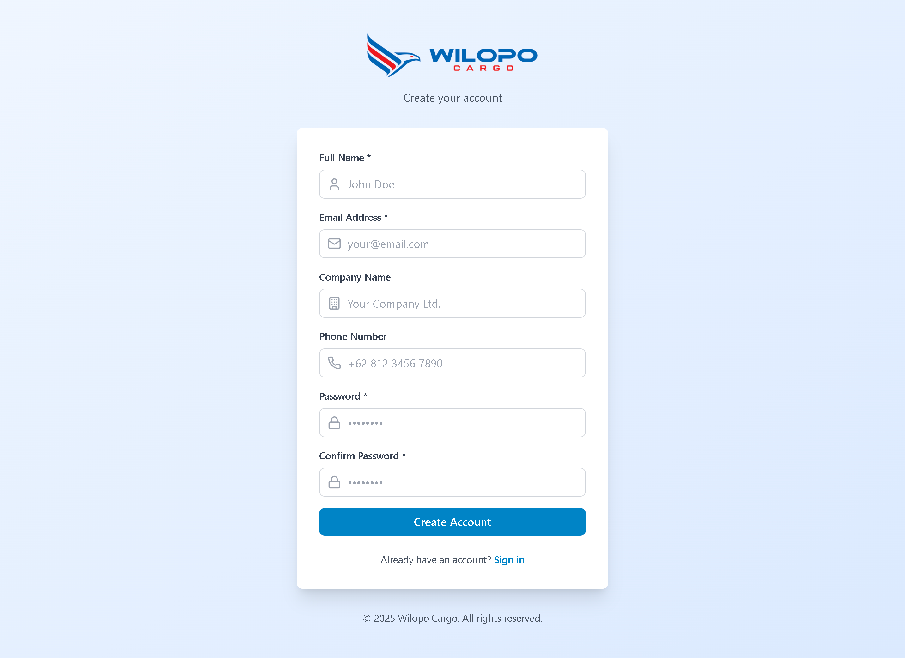
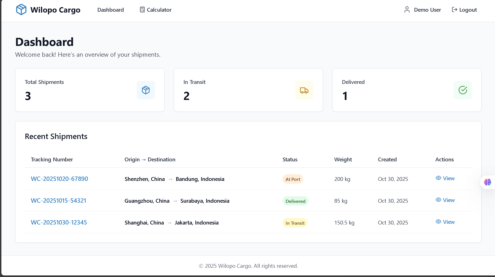
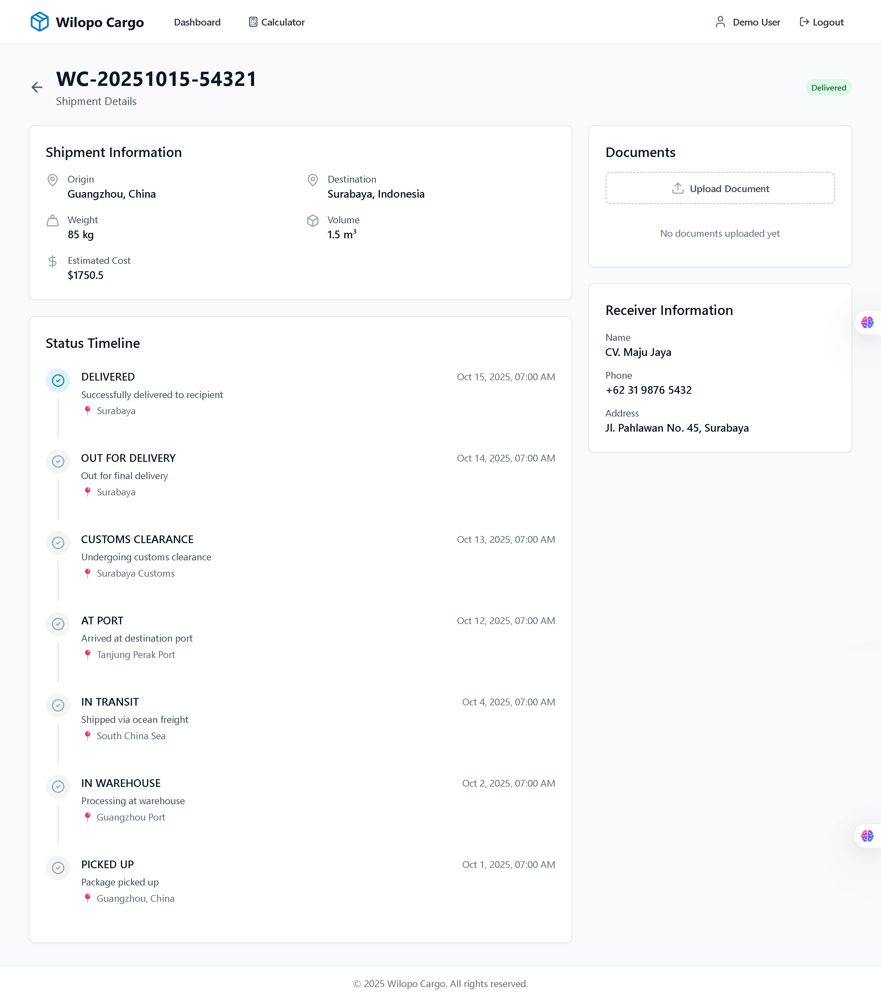
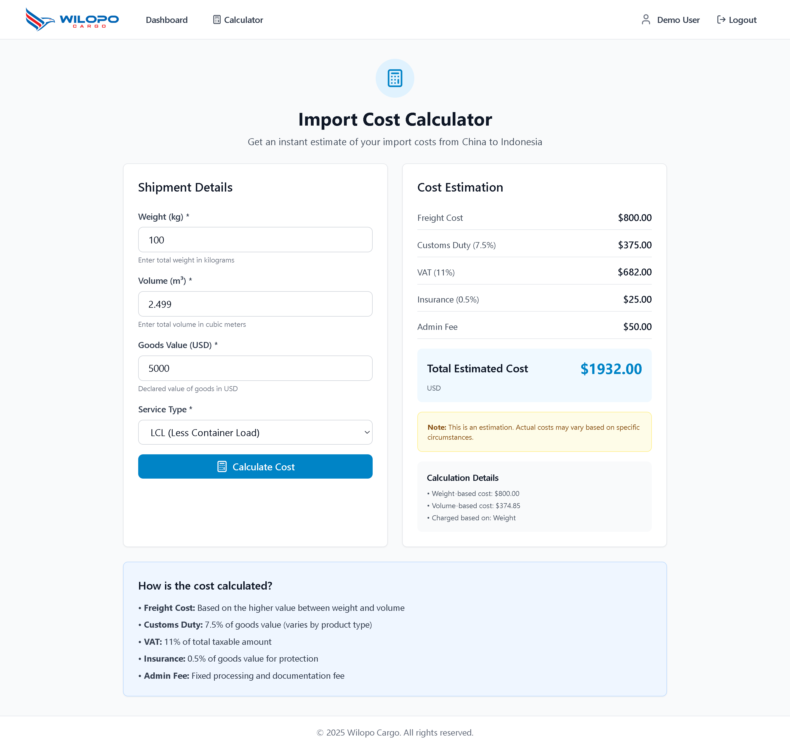
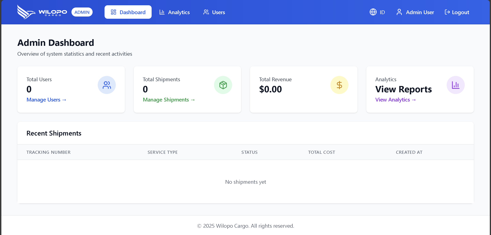
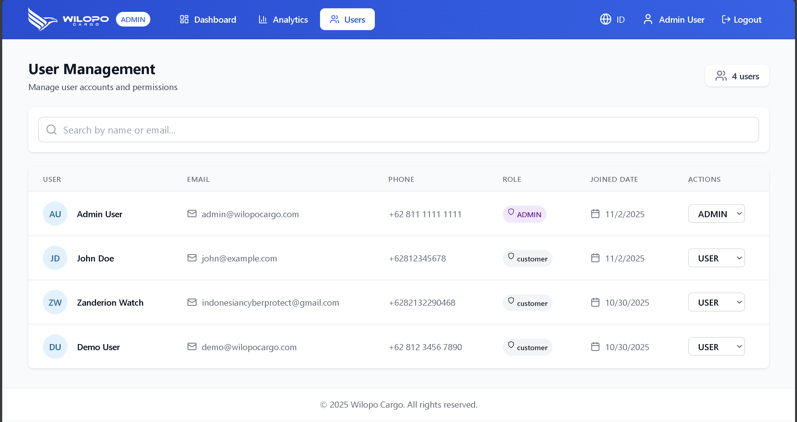
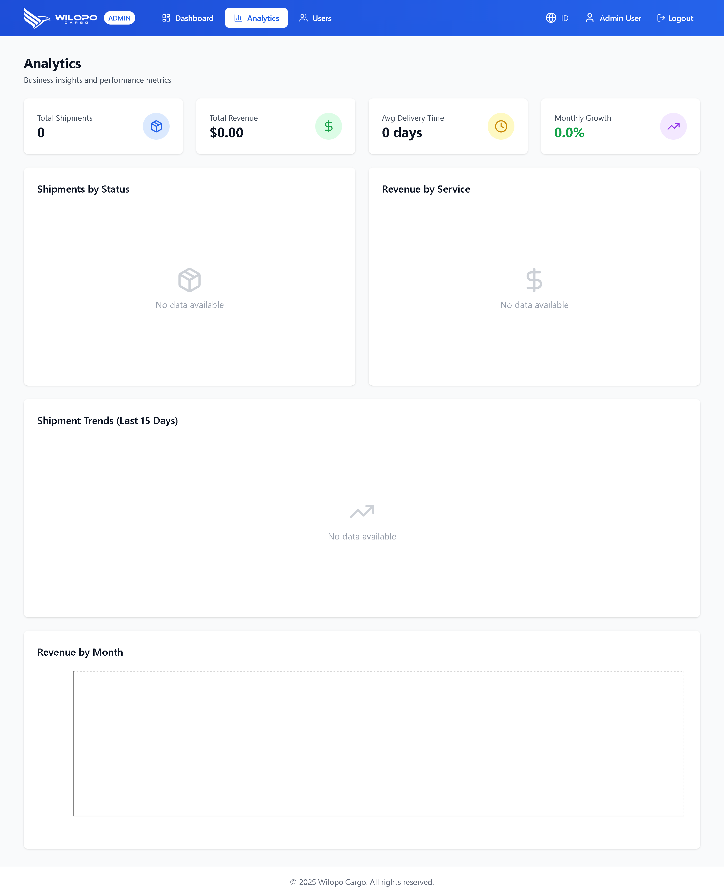

# 📦 Wilopo Cargo Customer Portal & Shipment Tracking System

[](https://github.com/yourusername/wilopo-cargo)
[](https://nodejs.org/)
[](https://reactjs.org/)
[](LICENSE)

**Company:** Wilopo Cargo  
**Development Timeline:** 3 Days ✅ **Completed**

> A modern, full-stack web application for Wilopo Cargo customers to track shipments in real-time, manage documents, and calculate import costs from China to Indonesia.

## ✨ Features

### Core Features
- 🔐 **Secure Authentication** - JWT-based login and registration
- 📊 **Interactive Dashboard** - Real-time shipment statistics and overview
- 🚚 **Shipment Tracking** - Detailed tracking with visual timeline
- 📄 **Document Management** - Upload, view, and download shipment documents
- 💰 **Cost Calculator** - Instant import cost estimation with detailed breakdown
- 📱 **Responsive Design** - Works seamlessly on desktop, tablet, and mobile
- 🎨 **Modern UI** - Clean, intuitive interface built with Tailwind CSS

### ⚡ Advanced Features (NEW)
- ✅ 📧 **Email Notifications** - Automated emails for status updates, welcome messages, and document uploads
- ✅ 🔍 **Advanced Search & Filtering** - Search by tracking number, filter by status, date range, with pagination
- ✅ 📑 **PDF/Excel Export** - Export shipment reports and detailed shipment information
- ✅ 👤 **Role-Based Access Control** - Admin and customer user roles with different permissions
- ✅ 🔔 **In-App Notifications** - Real-time notification system with read/unread status
- ✅ 🌍 **Multi-language Support** - Full English/Indonesian (EN/ID) interface
- ✅ 📊 **Analytics Dashboard** - Comprehensive charts and statistics with Recharts
- ✅ 🛡️ **Admin Panel** - Complete user management and system administration

## 🎥 Screenshots

### Login & Register

#### Login


#### Register



### User Role

#### Dashboard


#### Shipment Detail


#### Cost Calculator



### Admin Role

#### Admin Dashboard


#### User Management


#### Analytics


## 🚀 Project Overview

A comprehensive customer portal that enables Wilopo Cargo customers to:
- Track shipments from China to Indonesia in real-time
- View detailed status history with timeline visualization
- Upload and manage shipping documents
- Calculate import costs including customs duties and taxes
- Access shipment information 24/7 from any device

## 📚 Tech Stack

### Frontend
- React.js 18+ with Vite
- Tailwind CSS for styling
- React Router for navigation
- Axios for API calls
- React-i18next for internationalization
- Recharts for data visualization
- Lucide React for icons

### Backend
- Node.js + Express.js
- PostgreSQL database
- Prisma ORM
- JWT authentication
- bcrypt for password hashing
- Nodemailer for email notifications
- PDFKit for PDF generation
- ExcelJS for Excel export
- Helmet for security headers
- Morgan for logging

## 📁 Project Structure

```
wilopo-cargo/
├── client/          # React Frontend
├── server/          # Node.js Backend
├── project-brief.md # Technical documentation
└── README.md        # This file
```

## 🛠️ Quick Start

### Prerequisites
- [Node.js](https://nodejs.org/) v18 or higher
- [PostgreSQL](https://www.postgresql.org/) database (or use [Neon](https://neon.tech)/[Supabase](https://supabase.com))
- npm or yarn package manager

### Option 1: Automated Setup (Windows)

```powershell
# Run the automated setup script
.\setup.ps1

# Start backend (in terminal 1)
.\start-backend.ps1

# Start frontend (in terminal 2)
.\start-frontend.ps1
```

### Option 2: Manual Setup

#### Backend Setup

```bash
cd server
npm install

# Copy environment file and configure
cp .env.example .env
# Edit .env with your database URL and JWT secret

# Run database migrations
npx prisma migrate dev --name init
npx prisma generate

# Seed with demo data
npm run seed

# Start server
npm run dev
```

#### Frontend Setup

```bash
cd client
npm install

# Copy environment file
cp .env.example .env

# Start development server
npm run dev
```

### Access the Application

- **Frontend:** http://localhost:5173
- **Backend API:** http://localhost:5000
- **Demo Account:**
  - Email: `demo@wilopocargo.com`
  - Password: `password123`

For detailed setup instructions, see [SETUP_GUIDE.md](./docs/SETUP_GUIDE.md)

## 🎯 Feature Checklist

### Core Features (MVP)
- ✅ User Authentication (Register/Login)
- ✅ JWT Token Management
- ✅ Interactive Dashboard
- ✅ Shipment Statistics
- ✅ Shipment List & Search
- ✅ Detailed Shipment View
- ✅ Status Timeline Visualization
- ✅ Document Upload (PDF, Images, Office)
- ✅ Document Download & Delete
- ✅ Import Cost Calculator
- ✅ Responsive Mobile Design

### Advanced Features
- ✅ Email Notification System
- ✅ Welcome Emails on Registration
- ✅ Status Update Email Alerts
- ✅ Document Upload Notifications
- ✅ In-App Notification Center
- ✅ Advanced Search & Filtering
- ✅ Filter by Status, Date Range
- ✅ Search by Tracking/Origin/Destination
- ✅ Sorting & Pagination
- ✅ PDF Export (All Shipments)
- ✅ PDF Export (Single Shipment Detail)
- ✅ Excel Export (All Shipments)
- ✅ Excel Export (Single Shipment Detail)
- ✅ Role-Based Access Control
- ✅ Multi-language Support (EN/ID)
- ✅ Language Switcher Component
- ✅ Internationalized UI
- ✅ Analytics Dashboard with Charts
- ✅ Revenue Statistics
- ✅ Shipment Trends Visualization
- ✅ Admin Panel (Full UI)
- ✅ User Management Interface
- ✅ Admin Dashboard
- ✅ System-wide Statistics

### Future Enhancements
- ⏳ Real-time Chat Support
- ⏳ SMS Notifications
- ⏳ Push Notifications
- ⏳ Mobile App (React Native)
- ⏳ QR Code Tracking
- ⏳ Barcode Scanning
- ⏳ GPS Tracking Integration
- ⏳ Payment Gateway Integration
- ⏳ Multi-currency Support
- ⏳ Customs Clearance Tracking

### Security Features
- ✅ Password Hashing (bcrypt)
- ✅ Protected API Routes
- ✅ Input Validation
- ✅ CORS Configuration
- ✅ Security Headers (Helmet)
- ✅ File Upload Validation
- ✅ Role-Based Authorization

## 📚 Documentation

- [📚 Documentation Index](./docs/DOCUMENTATION_INDEX.md) - **Start here!** Complete guide to all docs
- [🎬 Demo Flow Guide](./docs/DEMO_FLOW.md) - **NEW!** User & Admin demo workflows
- [📖 Setup Guide](./docs/SETUP_GUIDE.md) - Detailed installation instructions
- [📡 API Documentation](./docs/API_DOCUMENTATION.md) - Complete API reference
- [📋 Project Summary](./docs/PROJECT_SUMMARY.md) - Implementation details
- [📁 File Structure](./docs/FILE_STRUCTURE.md) - Code organization
- [🧪 Testing Checklist](./docs/TESTING_CHECKLIST.md) - QA procedures
- [📝 Project Brief](./docs/project-brief.md) - Original specification
- [⚡ Advanced Features Summary](./docs/ADVANCED_FEATURES_SUMMARY.md) - Guide to advanced features

## 🧪 Demo Data

The application comes with pre-seeded demo data:
- 1 demo user account
- 3 sample shipments with different statuses
- Complete status history and tracking information

## 🤝 Contributing

This is a proprietary project for Wilopo Cargo. For internal development inquiries, please contact the development team.

## � License

Proprietary - Wilopo Cargo © 2025. All rights reserved.

## 🙏 Acknowledgments

- **Project Brief:** Ahmad Fauzan
- **Company:** Wilopo Cargo
- **Tech Stack:** Node.js, React, PostgreSQL, Prisma, Tailwind CSS

## 📞 Support

For issues or questions:
1. Check the [Setup Guide](./docs/SETUP_GUIDE.md)
2. Review the [API Documentation](./docs/API_DOCUMENTATION.md)
3. Contact the development team

---

**Built with ❤️ for Wilopo Cargo**
